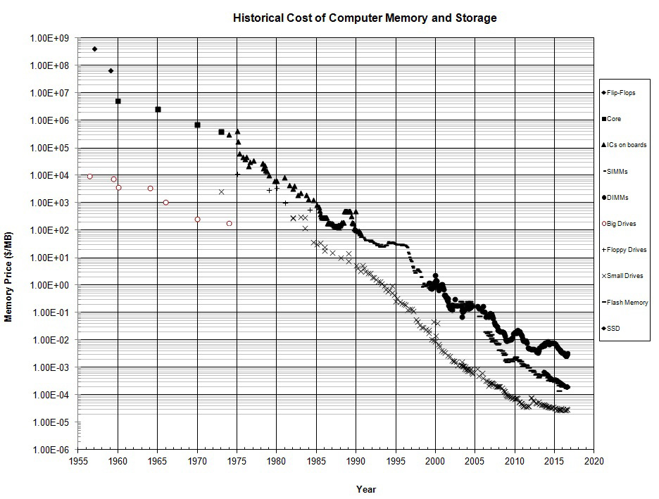
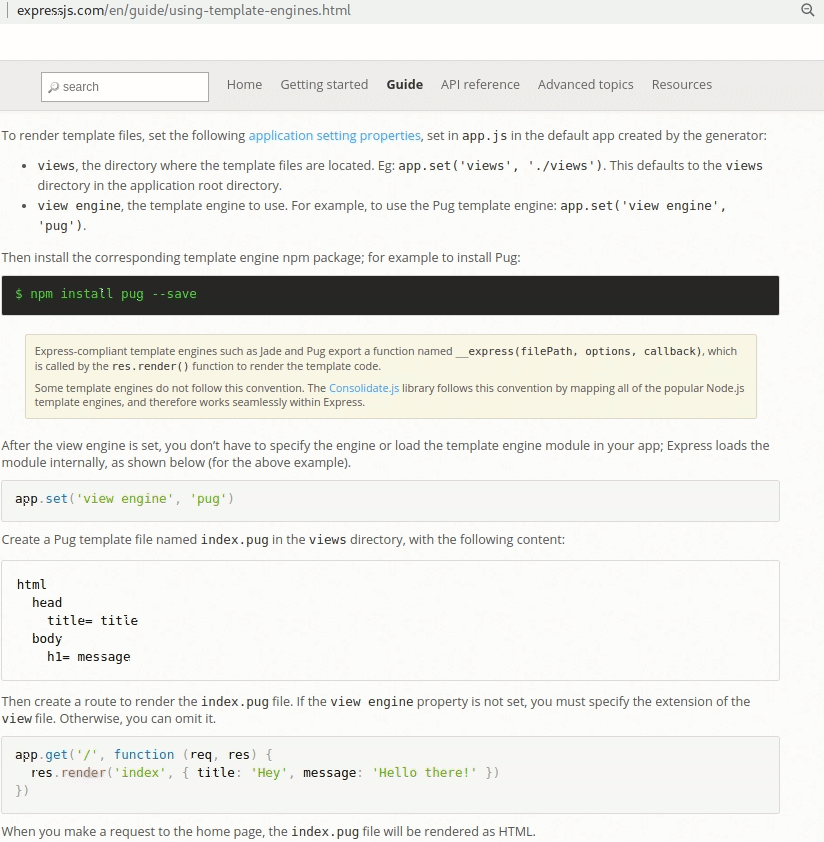
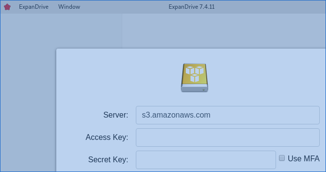


# Java ecosystem's 10 New Best Practices for the 2020s 
#### for back end / data engineering, relative to Java from 2010s.
by Vic Cekvenich

Summary: There are some radical differences in today's Java ecosystem relative to the prior decade. The listed difference add up to a difference in kind, not a difference in degree. We have achieved an order of magnitude improvement with the new adjustments in our development. The list has 10 points in 4 pages, including code examples.


Note, if you find typos or issues in this draft, please contact me, I have limited time to do open source. So please help open source, and be my tech editor. After this soaks a bit on the www, I may have it produced better, like in a PDF.

## #1: Starter enterprise cloud software architecture: Grand Prix 

In Chess, there is a library of named openings, such as Queen's Gambit. The opening, first 10 scripted moves or so, is played very quickly, and after it is on the board, the middle game starts where the moves vary. And there is a chess opening that is frequently played by international grand masters, informally called 'Gand Prix'.

There is a baseline enterprise cloud software architecture, I like to call it Grand Prix. From that baseline cloud software architecture, there are many variations, for example based on which of the top 8 cloud
providers you chose. (I recommend multi-cloud strategy). But in general, at hight level, it looks like implementation variations of this theme(drawn using Lucidchart) with 3 sections: data, analytics and app, each with detail inside of it.


### Old School

So before we jump into the 'Grand Prix', for fun, lets review the old school 3 tier architecture, what we had before the cloud:
You have an http server(eg. NGINX), app server (eg. Tomcat), and 2 DB servers(eg. MySQL). Two, because you write to one DB, that replicates to the second DB - and you mostly read from the replicated server.

###  Grand Prix 

There are 3 main sections again, this time they are: the cloud **data storage** section of the architecture - on top left, **analytics** section of the architecture - on the bottom, and the **app** section of the architecture - on the right.<br />
And new school, there is no http/https server, it is done by CDN at the edge (including certs). 
Aside a good way to get a feel for the new aproach, you should get comfort with something like Backendless.com, write an app using their REST calls. (If this paper is to much for you, then consider just Backendless.com till you need to slowly migrate from their API ).

NOTE: I list vendors only to illustrate and clarify, I'm sure your favorite vendor is the best one.  


#### Data Storage section

- The main part in this section is the **events** provider/ESB, so that we can implement some variation of an event driven architecture. Kafka (eg. Instaclustr), PubNub, NATS.  Consider starting with PubNub or NATS

- Also Auth/IAM (AWS Congnito | Backendless), is in the data section.

- Data area also include a rules engine, such as Drools

- SRE and first responders are here. Their main job is to monthly test restore/DC migration in case of a situation.

- Here we have object storage (in petabytes/exabytes or more) and SQL storage.  Object storage(key-value, where value is a list of rows) is typically S3 (Hadoop), there are dozens of S3 vendors, eg. Vultr.<br />

The benefit of object store 
is faster development iteration, since there is no schema. You can just write JSON lists of rows to S3. Likely you'd have more than one object storage service locations(eg: USA, EU, APAC), to be regulation compliant. Object store is nice, but nefit of SQL is: easy to get data out. You need both SQL and Object store.


<br />
Main parts is ESB. I won't go into variations of event driven application architectures or integration. Simplistically, app micro services generate a meta event on a aggregate of CRUD|business operations in sequence,  and analytics get updated. (and async, analytics generates an event that it computed, so micro services are notified of the new segment predictions for them to store in their local RAM)
Consider governors in event generators, such as debounce; and keep each event size smallish.  
<br />


- Also, here we have our app logs. (eg: ELK by Logzio). Use of logs includes debugging and error monitoring.
- And if there is a Blockchain | Hyperledger use case, consider implementing it as PGP. 

Note: Check out the helpfull reference section at the link related to data storage.

#### Analytics section

There are many parts in the analytics section:

- A RAM memory SQL DB (There are many, eg: Clickhouse, Spark, etc)<br />
Depending on the scale, you may need a DBA. This DB is also accessed by the app. section. For example to help show end users a recommendation. (eg: 'users like you also viewed this:').
The RAM memory SQL DB is populated in near real time from the S3 object store (ETL) This process is maintainted and operatated by the analytics team. 
 
- Reporting vendor (eg: Sigma Computing, Excel, Vega). This would include KPI Dashboard and predictive models(eg. Baysian or Linear). If you like ML (eg Tensorflow) it is in this section.

- Network security(eg. DMZ) around the entire analytics section.<br />
For example. A VPN, that is sometimes also a 'Bastion', to access a NAT based VPC. 
Depending on the scale, you may need a Netops/Linux security FTE. This part can also be implemented using iptables; after all, all the netops security 'boxes' are just linux apps.
If you are not worried about data security, don't invest in it, skip this part. :-}


- Performance monitoring of your UX, or some version of APM(eg. ScountAPM), is usually in the analytics section architecture <br />

- QA and pen-testing is here

- Analytics section may also include 'bots' (eg. Puppeteer ). They are used for scraping external data (eg. SEO rankings), and more. (More than 25% traffic on www is bots).


You may for example push a button, to add/remove K8/Docker instances in the apps section via K8(OpenShift). 

#### App section

The app section has all these parts:


- Front end(FE) app. FE is outside of the scope of this write up. ( But a few things to chew on regarding FE: Consider looking at JAMstack, low code and cross platform development such as Futter. The hard part of FE development is naming css classes in a way that facilitates maintenance. FE is disposable and needs a updated often to match the changing market needs. Pay attention to the ratio of the number of back end engineers vs./ the number of sr. front end developers. And good luck to all the FE devs, often it is harder than the back end.)

- Client side API and client side ViewModel. This is not written by FE developers, but by back end team. Even if it runs on the client side,  inside
the user application|web page, back end team should implement it. Below in this article: #8 explains more on this point. The major requirement of the client API: topology aware client.
Also E2E testing, auth, etc. And since SEO needs static data, maybe both back end team and FE team together on SEO rankings implementation - if your apps needs such.
</p>
One example of FE app UI is: voice and chat applets. Don't forget that in your architecture. Just because you have a computer that is not seen, does not mean it's not there.

- Data plane: Edge / Geo DNS/ Data Plane / CDN(w/ https), trough the proxy, accesses the load balanced stateless services. (services include serving static assets like HTML, css, PNG, video, and streams, such as video). A proxy Eg. would be EnvoyProxy | Istio. FE|Client apps talk to the CDN pop closest to them. CDN provides HTTPs offloading and early TLS termination. And it hides the IP of the 'REST' services, making them harder to attack. Also CDNs provide HTTP3, udp based. CDN's handle the TLS certs. And a nice thing CDN provide is: caching. We set the cache in the header of each request. This significantly simplifies development and reduces operating costs. For example set cache on a REST API to 2 seconds.  Don't use HTTP servers (eg: NGNX), use the CDN and other edge features.(eg: CDN77).  CDN is one of the big wins on migrating to the cloud: it is cheaper and faster. So GeoDNS for Blue/Green deployment, talks to CDN, that talks to proxy to help shape the traffic, and the proxy talks to the service container.

- HMI Micro Service in containers(Docker), with a K8 manager (OpenShift). . The client API's and ViewModel talks to these services. These service containers are GEO distributed, at minimum EU and Americas data centers, but possibly more granular. The service containers are HMI - high memory, for example 512G of RAM or more. Cloud instances tend to have slow and variable I/O and you want to avoid it via RAM as Disk. Section #4 in this write up touches on it.
They would use local Redis memory or local SQLite memory for things like queuing and to have locally things that are needed to operate the service. We try to avoid network latency of services by having the data in the application RAM. You of course 'warm up' the container by accessing your data store and analytics data, and have a background daemon thread that keeps local data fresh. 
<br />
IMPORTANT: Micro services application architecture is hard. They are  used to allow independent scaling: we add containers to increase scale. This obviously does not work if different micro services are bottle-necked by the same back-pressure of the same downstream service(eg. S3 bucket). It's not a micro service, unless someone engineers a design to allow independent scaling and a way to plan and manage capacity. You could still have a monolithic application architecture in different containers! You know you are doing it wrong if your design took only days to come up with and did not include stress testing to verify the design hypothesis of the capacity plan. 
<br />
Aside, services may call other services (eg. via DNS subdomain URL).

- In some cases, a stress tested edge-based Service/API gateway|mesh may help(eg. Cloudflare Workers, or DNS.jar). However, a centralized one **may** not scale. 

<p />
Aside, the Devops issue/ticket tracking (eg. VictorOps ) is in apps.
<p />
So that is it for high level Enterprise cloud software architecture: Grand Prix. 


Now lets go a bit lower level, and into code...


## #2. Scala, Kotlin, Groovy
SDKMan, Scala, and Java 11 are incremental improvements for the 2020's Java ecosystem.

Kotlin is the default JVM language used for Google's Andorid platform. Scala is popular for Data Science. And Groovy is dynamic, like NodeJS and Python - that are now more popular than java.
All 3 are more concise than Java for writing applications. Of the 3 Scala seems easiest to adopt; you can  go to a webpage online and paste Java code and it will be converted to Scala. 

But, when writing a library, it is better to write it in Java, so it can be used by all other languages on the JVM platform. So the core code would be Java, but development of the application should be Scala, Groovy or Kotlin. You should be polyglot in any case.

Today we install Java 11 LTS via SDKMan, and simply run the app via, usually inside a shell command:

```
	java -jar myApp.jar
``` 

Oh, an why be JVM based? Because JVM is better then C++, the closest alternative. (One example of why C++ is bad is that a trillion dollar F35 plane is a failure, and it was written in C++. I find C++ a risk to the delivery of a project)

## #3: Cloud, eg.: S3

There is still a lot of organizations that have not moved to the the cloud. One of the base cloud service is S3 (aka Object Store or Hadoop). 
S3 providers include AWS, GAE, but also Linode, Wasabi, Vultr, etc. Storing data is very cheap, almost free, so storing PetaBytes and more is now common. Here is an example of writing 3 million rows of data to Vultr's S3 from Scala (using the Java helper classes):

```
    val s3: BasicS3Util = new BasicS3Util(server, access, secret, bucket)
    new LoadS3().load(s3)

```
And that calls this class:

```
  def load(s3: BasicS3Util): Unit = {
    new SNX().getSNX
    _s3 = s3
    ins() // each ins() is a million, so 3 million rows inserted
    ins()
    ins()
   }//()

   def ins(): Unit = {
    // 25*40* 1000 = 1 Million rows inserted
    val mCount: Int = 25
    var i: Int = 0
    while (i <= mCount) {
      val t: TimerU = TimerU.start()
      _insBatch(40 * 1000)
      i = i + 1
      println(" in " + t.time())
    }
  }//()

  def _insBatch(count: Int): Unit = {
    var i: Int = 0
    val lst: java.util.List[java.util.Map[String, Object]] = new ArrayList()
    while (i <= count) {
      val row: java.util.Map[String, Object] = new HashMap()
      row.put("name", _faker.name.nameWithMiddle())
      row.put("ip",   _faker.internet.ipV4Address().toString)
      row.put("cc",   _faker.business.creditCardType())
      row.put("dept", _faker.commerce.department())
      row.put("price",_faker.commerce.price())
      lst.add(row) 
      i = i + 1
    }
    _s3.put(prefix, lst)
  }//()

```
The helper functions convert the java.util.List of rows into an InputStream, because S3 is implemented as a Hadoop file system. Once stored, we can later search our lists via 'path'. Also, there are some evolving data services: SQL built on top of of Object Store|K-V.

** RECOMENDATIONS **: There are many cloud service in addition to S3, too many to list. Some example I like include ELK in the cloud by https://logz.io/platform, SigmaComputing for DataViz, PubNub for ESB, Backendless, MailJet for SMTP, Netify Forms API for low-code, algolia search, etc. Everyday there are more ways to leverage the cloud to improve capabilities, increase business flexibility and reduce costs. 


## #4: DB in RAM Memory

DB's using RAM storage only is a new and revolutionary improvement.
Our new RAM friends include Clickhouse, etcd, Aerospkie, Spark, SAP HANA, Apache Ignite, Apache Arrow, etc. 

Our old friend Redis works well, as does SQLite. 
Before the 2020's a Databases (SQL, Object, FTS, Graph, etc.) would be stored on an SSD, NVMe, M2/U2, etc. 
But now cloud providers have machines that have 512 Gigs of RAM and more, and even terabytes of RAM is available. And RAM is much faster than any type of SSDs. Plus I don't have to worry about the **randomly slow I/O performance** of a container.
And if terabytes is too small for your RAM DB: You can cluster you DB cloud containers and combine several DB servers into any size you need, with a bit engineering, or by using an of-the-self solution (eg. Clickhouse). 
<p/>
Note how prices for storage keep droping. 


And how L3 size keeps growing, for example 128M and more. In essence, L3 becomes RAM, and RAM becomes storage.<br />

In addition to DB clusters, it is now common for the RAM DB to also be local in your application's container. A 'fat memory' container w/ 512Gig or more, that reduces network latency, adapting the Spark architecture. Your cloud VM's should be 512 Gig or RAM or more, where each Docker container also has local Redis or SQLite. And if you don't properly configure your cloud containers you will end up overpaying for your cloud. 


I did not show a fat container code, how to write a Docer container, as that is basic classic code.


#### Note: Even in a 'fat memory' container you want to configure as a micro-service, to enable independently scaled  load.

This is a a paradigm shift, and requires learning and internalizing.  I recommend that your local development machine should also have 128Gig of RAM or more so you get a fell for the approach. Some development workstation with 128Gig plus of RAM are iMac Pro, System 76 and Digital Tigers.

##### Aside: Lots of people use a term Big Data. It is not Big Data if it fits on my $800 laptop with 2TB SSD Driver. There is no need to cluster data that are in terabytes, it fits in on a single box! I recommend a new term: small data, when you could fit it in a single consumer-level laptop.

### Spark-like Data Engineering

Spark is very popular. I'm going to oversimplify Spark: it lets you take unstructured data from data lakes such as S3, then execute memory SQL and statistical operations (via a Spark/K8 clusters) and report on the data by using charts and graphs. 

A custom Spark solution will be much faster. We can read columns from S3 into a SQLite temp table in RAM, and then use the Java Poi library to save to a spreadsheet. From a spreadsheet 
it is a few clicks to make a chart or a graph. For other needs, clustering SQLite wrapped in a Java service does not take much effort. 
In any case, SQLite can be completely in RAM, or can have temp tables in RAM for materialized views - and SQLite can provide the magic to amaze your users.

Plus, Data Engineers use CSV, but using SQLite DB file is a big improvement when sharing. 


### Demo Example 1: 

Here is an example project folder that includes items we mentioned so far. It is a simple Scala project that uses a Java lib (in the lib folder, but deployed )
 that measures how many records we can read from S3 and insert into SQLite per second. You can change the code to have SQLite built-in feature to use RAM DB instead of disk. It leverages a few helper classes that I added to the SNX lib.

- https://github.com/intuition-dev/SNX/tree/master/SNX_01db


## #5: Tools: Gradle.build, Cloud IDE

Gradle is a big improvment over Maven or similar and should be the backbone of your project.


###### No XML. The entire code base backing this article is not using any XML. I have seen cases where XML can be a repelant for good programmers, they move to other platforms. Rod Johnson, creator of Spring-Boot has encouraged migration away form XML with some public hints.

And, before the '20s we started deploying apps to the cloud. And now even our IDE can be in the cloud as well, check out CodeAnywhere (or VS Code in the cloud) for you development environment.


## #6: JAR for Services/'REST', with Reactive Streams

#### A quick history review: 
In ancient times, Java devs would use containers such as Tomcat via WAR files that contained WEB-INF/libs and such. Then it evolved into Webapps using Trustin Lee's Netty project - used by Twiter, Akka, and more. Netty was an async (NIO) network library, just a jar and did no need for WAR or containers, making it easier to work with.

And in 2010's Reactive programming became popular (I won't explain here what Reactive is, it would take more space, but most of the explanation on WWW are ... poor) and Reactive Streams were added to Java 9 by Doug Lea. In 2020's. by Oleg Kalnichevski's Apache http core is a Java library like Netty, but can leverages the Java 9 reactive streams. Think of it as Netty's next version. So we'll use that!

### Demo Example 2: 

Here is an example Scala project folder that uses Apache http core library v5 that emits a simple 'REST' GET JSON response. It also acts as a simple HTTP Server, so you can write an index.html that uses **fetch()** (we don't use Ajax anymore) to GET that JSON. The example is synchronous, but the library used supports reactive streams. 

- https://github.com/intuition-dev/SNX/tree/master/SNX_02web


## #7: Stress/Load testing

Java now comes with a built in HTTP Client. In the past we might have setup jMeter or Grinder for stress testing, but now writing a stress test script the uses the built in Java HTTP Client wrapped in Java Executor thread pool makes it just as easy to script GETs and POSTs. A simplistic example that you would run in Java Executor thread pool:

```
	public String GET(String uri) throws Exception {
		HttpClient client = HttpClient.newHttpClient();
		HttpRequest request = HttpRequest.newBuilder().uri(URI.create(uri)).build();

		HttpResponse<String> response = client.send(request, BodyHandlers.ofString());
		return response.body();
	}
```

There are a helper class in the lib I used that wraps this method in an executor to simulate appropriate stress/load. You need to write a CLI(app) Scala script to start the http services, and in another tread run the stress test, and then report the results. For example email the results. 
Stress/Load testing is **not optional**. It must be scripted into your CI process to catch any performance regressions. You must get a **C10K** rating for 99th precentile latency for each service. It's not easy, but what makes it cost effective is fat memory containers: since you can put mutilple load generators in the same instance. To create a network based load would be very expensive.


 For CI, Github has hooks that can transparently call our little Apache http core lib and  email  the performance results as well as use the Jitpack API as needed.

### Next: JAMstack.org

Next few points will touch on something called JAMstack, simplistically it is an  API way of working with (generated) front end, including SPA.

## #8: Client side API, Client side ViewModel

Today from a browser we write **fetch()** instead of Ajax calls. A question: Who should write that fetch() command that runs in the browser on the client side? With JWT or similar secrurity.

2020's the answer is: Back end engineer! The 'Java' guy that wrote the 'REST' service also writes the client side API to call that service. As well as documenting both REST and API.

The APIs are done by the back end team going forward. Front end has to worry about UX, CSS design, CSS frameworks. And back end team supports them. Those API calls fetch() commands are writen in a ViewModel class (JavaScript/TypeScript support classes that can transpile to ES5/IE11 via tools like PrePros.io and such). You, my back end friend, write a ViewModel per page/screen, just like before 2020's, when you wrote the ViewModel server side. Now you do it **client side**. (If this is confusing, then do a sample app w/ Google's FireStore or better: Backendless.com)

This is where a git 'uni repo' comes in, the ViewModel is tied to the View and the ViewModel API are tied to the server side services, and a uni repo makes sure that a release is synced! And the back end team has to follow the View changes and map to it. The front end developer just uses the ViewModel, and does not touch the internal fetch() code that does CRU/D, CORS or state management. 
This way it is the back end developer that is responsible for data security, TLS and user authentication of each API call, it is their lib. We all found out that the front end developers can't do data security layer well. So back end team handles all the user authentication, access and data security. You can even do fancy things related to **topology aware client**, such as calling EU, USA or APAC back end as needed,** timeouts**, or even more tricks.  For example if you change the encoding, you don't bother the front end devs. They use the ViewModel and are not aware of the implementation. <br/>
Note: Topology aware client enbales both scale and 'five nines', if that is a requirment. 
<p />

Of course, same goes for IOS(Swift)) and Android(Kotlin) apps: or more likely Fultter (or Cordova) since Cross-Platfrom is best practice. Back end/data engineering team  must be polyglot and write and support the ViewModel and API calls cross platform and document and test it.


Let me should you example code.
Here is the server code snippet using Apache http core that  emits a REST response to **/API1** and acts as a http server serving html files and assets:

```
  var _routes: Map[String, IRoute] = routes
  var _docRoot: String = docRoot

  def handle(req: ClassicHttpRequest, resp: ClassicHttpResponse, context: HttpContext) {
      // browser and CDN cache:
      resp.setHeader("Cache-Control", "public, max-age=" + 1 + ", s-max-age=" + 1)

      var PATH: String = getPath(req)
      // check if File in docRoot, else serve an SSR Route
      var file: File = new File(this._docRoot + PATH)
      if (file.exists() && !file.isDirectory()) {
        serveAFile(file, resp, context)
        return
      }

      // above is file, but now API route not found?
      if (!_routes.containsKey(PATH)) {
        var outgoingEntity: StringEntity = new StringEntity("no such resource " + PATH)
        err(resp, outgoingEntity)
        return
      }

	  //else we have an API route registered
      var r = _routes.get("/API1")
      var params = getParams(req)
      var ret = r.ret(params)
      var outgoingEntity = new StringEntity(ret)
      good(resp, outgoingEntity)

```

And here is .js file loaded in a browser that calls above service:

```
	class UserVM {
	   constructor(cb) {
		  fetch('http://localhost:8888/API1')
		  .then((response) => {
		    return response.json()
		  })
		  .then((myJson) => {
		   cb(myJson)
		  })
	   }
	}//class
```

Enjoy.  


## #9: Switch testing focus to E2E testing

E2E is end to end testing. You can still do some unit testing as needed, for example for libraries. ( I would recommend avoiding XML. Even if you use IOC, there are pure Java IOC libs that avoid unchecked Strings in the middle). But E2E 100% test coverage is required, of the above mentioned ViewModel.

With E2E you automate the testing of the end point, in this case you test the ViewModel/API.  If the ViewModel works, then everything integrates and everything else must be working behind it! So in addition to stress/load testing of the server service, you must do ViewModel/API testing of browser ( Android and IOS). 


E2E is a radical difference and requires time to internalize. You should do the lab here that does a simple E2E test. 
E2E has 5 components: 

- 1) ViewModel/API javascript, one per each page/screen of the application. This is what is tested.
- 2) A running http service that provides 'REST' services to that View/Model API; and a running http file server that runs the html ages so we can server them. Usually it is one and the same, a single port used for API and http files.
In our case our lib will use Apache http core to do both, serve REST and serve html files.
- 3) QUnit(or similar) index.html page that in the browser tests the ViewModel/API .js CRUD methods. Your E2E tests are written in .js to run on client side. We can run this test manually by opening the test pages in a browser. Errors and success is reported to the calling .js function that starts the test.
- 4) Selenium Chormedriver (v4), in Java will open the test page, and call a .js function to start the 'QUnit' test. It will then report the test results, for example via email. So you will have a CLI Scala script that runs the http server and runs a Selenium in another thread that call to the .js testing function.
- 5) CI/CD server that is running at all times in the cloud, the deploys and runs the tests. It gets called by a dashboard or webhooks to do E2E, stress testing, staging deployments, etc. (eg: JitPack, Jenkins, etc.)

So those are the 5 parts for E2E test.

I will not show the Selenium code since this is classic code (and the full source code example code is available in this git project).
But I'll show you the QUnit javascript/typescript code on the client called by Selenium, that tests the ViewModel:

```
class TestVM1 {
   constructor () {
      depp.define({'vm1':'/api/UserVM.js'})
      depp.require(['vm1'], function(){

      QUnit.test( "hello tests", function( assert ) {
         TestVM1._done1 = assert.async()
         TestVM1._assert = assert
         console.log('in test:')
         new UserVM(function(json){
            console.log(json)
            _WDcb(json)
            TestVM1._assert.ok(true) //passed. Should check json, but...
            TestVM1._done1()
         })
      })//tests
      })//req
   }//()
}//class

// setup the webdrive callback
var _WDcb
function webDriverFoo(WDcb) {
   _WDcb = WDcb
   console.log('start tests')
   var pro = loadQunit()
   pro.then(function(){
      QUnit.config.autostart = false
   
      //QUnit.start()
      new TestVM1()
   })//pro
}

```

You should try to do this lab. It does have many parts, but once it is automated it becomes second nature. 


### Lab Example 2: 

So here is a Lab you should review, Selenium E2E calling fetch() API in a .js ViewModel, full code of what we talked about:

- https://github.com/intuition-dev/SNX/tree/master/SNX_03E2Etst


Note: This is a Java version - but I have to say Nodejs puppeteer makes this easier.

Asside: Most of the time you want to front your service with a modern HTTP server, such as Caddy.

## #10 SSR (Server Side Rendering) with Pug

We used to use PHP, ASP, JSP for SSR, approximetly 40% of web apps are PHP.
And here is what we use in NodeJS, a more modern approach:

<table><tr><td>
  
</td></tr></table>


In Java/Scala we can do this to mimic the Express example above:

```
   var _render: JadeConfiguration = new JadeConfiguration()

  def Pug(): String = {
    val cwd: String = System.getProperty("user.dir")
    val loader: TemplateLoader = new FileTemplateLoader(cwd + "/routes/", "UTF-8")
    _render.setTemplateLoader(loader)
    _render.setCaching(false)
    val template1: JadeTemplate = _render.getTemplate("index.pug")
    
    val model1: java.util.Map[String, Object] = new java.util.HashMap[String, Object]()
    model1.put("city", "Bremen")
    //binding
    val html: String = _render.renderTemplate(template1, model1)
    html
  }
```

Are you not impressed yet? OK, let me teach you Pug in 15 seconds:
- https://html2pug.now.sh
End of lesson. It just converts to HTML, the way SASS converts to CSS.

2020's we use templating engines, for example eBay uses Marko and here is other examples on staticgen.com. Pug is a good template engine. When you need SSR, use Pug. 
Pug apps are great for SEO and AMP.


## #Eleven: Content in the cloud! ('These go to eleven')

We can combine #3(S3) with #10(Rendering generator) when doing content, such as CMS or e-Commerce. And everyone does CMS, for example video blogs for SEO. 
If you have lots of video, images or other content,  you can/should store it as objects on S3, becuase S3 is built on top of Hadoop for massive storage, exabytes even. 
S3 versions even!
Now that you content and assets there, you can write(in Scala) a (Pug for example) generator that makes HTML pages. SPA, AMP, etc. etc.! 
So combine S3 w/ a rendering generator and now you have content that can be consumed via a browser!

(Example tools include ExpanDrive, Mountainduck.io, s3fs-fuse and my fave https://github.com/kahing/goofys )



Easy enought to put an html file server in front as needed, and write Java code that generates html.
So put all your static assets and the asset pipeline on S3, and server it from S3. This makes the entire architecture 
friendly for the content editors. 


##### The End

----


## Review

The goal of the best practices is limited to what an average engineer can learn then in 1 day, and a Sr engineer can learn them in 1/2  a day.
It was influenced Spring-Boot, Spark and Akka

The major changes are that you must use 128gig to 8tb of RAM per node, you must do stress testing, and the ViewModel is now client side. But other changes also contribute to the significant improvement and ease of development. 

### A Call for  help:

Are you an experienced Java tech leader?
If so:

- I listed some good particles. Is there another new modern practice missing?

- And is there anything I should remove or correct!
Reach out to me please and help: vic(at) eml.cc


## Bio

I am Vic Cekvenich, my claim to fame is writing the first book on Java Struts MVC, a predecessor to Spring. ( https://cekvenich.github.io/cekvenich/book.pdf ) I have been looking at Apache Spark, Akka, Spring boot, etc. and I think we can improve. There are even a few ideas we can leverage from NodeJS's Express library and JAMstack.org
Better, easier and faster. So lets review my list of 2020's Best Practice pillars for the Java ecosystem: 

- Personal web page with projects: https://cekvenich.github.io/cekvenich 


## Reference

Helpful scaling & stress testing links:

- https://sj14.gitlab.io/post/2018/12-22-dbbench
- https://yourdatafitsinram.net
- https://github.com/cdr/sshcode
- https://medium.com/@rbranson/sharing-sqlite-databases-across-containers-is-surprisingly-brilliant-bacb8d753054
- https://news.ycombinator.com/item?id=22130874
- https://github.com/benstopford/awesome-db-benchmarks
- https://www.altinity.com/blog/2020/1/1/clickhouse-cost-efficiency-in-action-analyzing-500-billion-rows-on-an-intel-nuc
- https://tech.marksblogg.com/benchmarks.html
- https://www.scylladb.com/2019/12/12/how-scylla-scaled-to-one-billion-rows-a-second
- https://datadome.co/bot-detection/store-50-million-event-per-second-in-elasticsearch
- https://pixeljets.com/blog/clickhouse-as-a-replacement-for-elk-big-query-and-timescaledb/amp


#### Aside:

You may like downloading and running this jar: https://github.com/subhra74/snowflake

