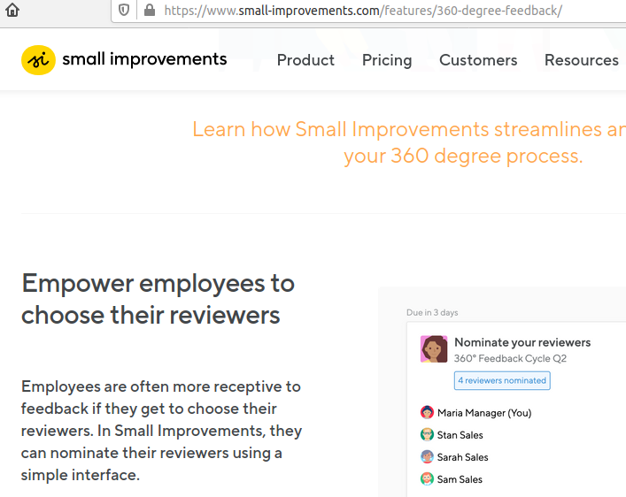

# Eng. Tooling and Management Budget
by Vic Cekvenich

# Eng. Tooling 

There are organization where top management jokes about: I don't even know why we are spending $60K per month on AWS. And they do that with pride.

One way to manage is to plan what you should be spending. That allows you to the compare and monitor to what you are spending on tech.
And it does not have boring, you can just come up with some ideal spending. Here is some ideas to help you with your budget line items:

## #1: Development / IDE

- Development is now moving into the cloud, so instead of running VS Code locally, you would run it in your cloud Linux box - a bit similar to CodeAnywhere.com. And more secure than local development :
 

- For front-end and designers you may use something modern, like Corvid or WebFlow. :

 

 

- For back end, you may want to leverage modern cloud services such as Google FireBase, it does an OK job w/ User Auth. Similar to FireBase is Strapi.io and it is free. Maybe user auth should be it's own line item : 

- And it maybe nice to have some automated code review like Codacy:

### Dev. tools budget 
About $75 / month / developer.
So a team of 8 is ~$7K annual.

## #2: Architecture / DB

- When using a cloud, one of the popular services is S3 store: 

- If using micro-services, you'll need an enterprise event bus, like NATS:

- And you'll need a CDN, it makes things cheaper, faster and safer: 

Plus some Docker cloud host, eg. DO.

### Architecture budget / Environments
About $150 / month / environment. Likely you'll have following environments:
2 Production:Blue/Green/Canary/EU
1 Staging Branch: Beta/QA
1 Dev(CI/CD Master):
So 4 environments is ~$6K annual.

## #3: SRE Infrastructure 

- You do need centralized logs:

- And monitoring:

- As you start getting customer traffic you'll need to build a centralized NOC/SOC dashboard, eg. Grafana:

- With growth, you maybe doing infrastructure as code, Pulumi ( or Teraforma ):

- Pulumi has help with compliance (eg SOC, HIPAA, PCI, etc. ):

### Infrastructure tools budget 
About $250 / month.
So about ~$3K annual.

## #4: Testing, QA and CD

- In order to do capacity planning, you'll have to use one of the many load generators. If you use network, it will be expensive, so just use large RAM VM so you can have all the services and load generators VMs on the same box. If you don't do load testing, you can't do capacity planning. Large RAM cloud: 

- CD:

- Mobile apps CD:

- Testing, E2E, there are 2 example vendors, Cypress and Puppetry: 

### Testing tools budget 
About $500 / month.
So about ~$8K annual.

## #5: Optional: Business Intelligence & business value

- Basic analytics : 

- Optional analytics support :

- Business dashboard :

- BI integration :

### BI tools budget 
About $1.2k / month. 
So about ~$15K annual. But sometimes people don't have a budget for BI.
As an alternative to BI budget, Excel can connect to SQL and run queries for basically free.

# Management tools

## #1: Day to day

- Task tracking Notion, or AirTable ( most people don't like Jira ):

- Daily status reports, I like video: 

- Screen shot tool: 

- Live meetings tool: 

### Day to day tools budget 
Day to day $75 / month / resource.
So a team of 8 is ~$7K annual.

## #2: Management tools

- Managing up, one of the most important tasks for VPE is doing info-graphics: 

- 360 Management, OKR and 1:1 tool:

- Job posting:

### Management tools budget 
Day to day $80 / month / resource.
So a team of 8 is ~$8K annual.

# Resources / Salaries budget

2 FE /designer remote $25 / hr (100K) 
1 BE / dba  $100K  
1 BE / BI remote $15 / hr (40K) 
1 SRE remote USA weekends $150K / yr  
1 QA offshore weekends up/work $12 / hr (30K)  
1 SA remote Upwork $50 / hr (100K)  
== 
$550K for staff

And tools:
7 + 6 + 3 + 8 + 0 + 7 + 8  
==
~$40K

and a remote VPE ~ $150K to run it, so a total of ~ $700K / year.

### A good use of this is for you to do your own budget

I hope above gives you ideas. If I missed a category or if something I have listed can be more efficient, please get in touch and let me know.

If you have a line item missing from the budget, it still can fly, in the way a plane can fly with one wing. 

